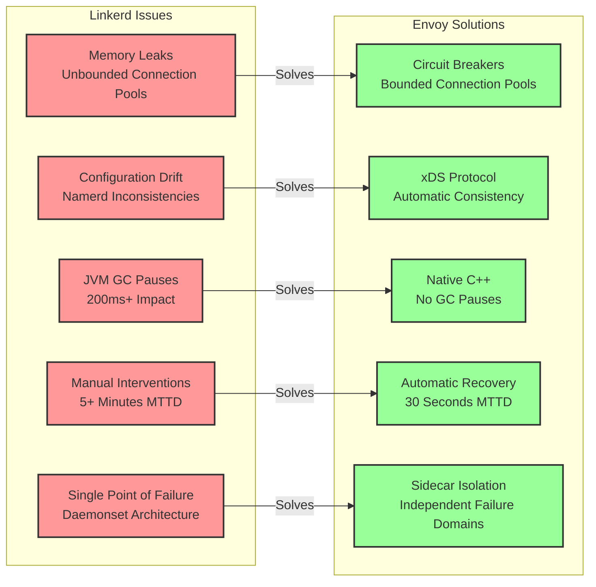

```mermaid
graph LR
    subgraph "Linkerd Issues"
        L1[Memory Leaks<br/>Unbounded Connection Pools]
        L2[Configuration Drift<br/>Namerd Inconsistencies]
        L3[JVM GC Pauses<br/>200ms+ Impact]
        L4[Manual Interventions<br/>5+ Minutes MTTD]
        L5[Single Point of Failure<br/>Daemonset Architecture]
    end
    
    subgraph "Envoy Solutions"
        E1[Circuit Breakers<br/>Bounded Connection Pools]
        E2[xDS Protocol<br/>Automatic Consistency]
        E3[Native C++<br/>No GC Pauses]
        E4[Automatic Recovery<br/>30 Seconds MTTD]
        E5[Sidecar Isolation<br/>Independent Failure Domains]
    end
    
    L1 -->|Solves| E1
    L2 -->|Solves| E2
    L3 -->|Solves| E3
    L4 -->|Solves| E4
    L5 -->|Solves| E5
    
    style L1 fill:#f99,stroke:#333,stroke-width:2px
    style L2 fill:#f99,stroke:#333,stroke-width:2px
    style L3 fill:#f99,stroke:#333,stroke-width:2px
    style L4 fill:#f99,stroke:#333,stroke-width:2px
    style L5 fill:#f99,stroke:#333,stroke-width:2px
    style E1 fill:#9f9,stroke:#333,stroke-width:2px
    style E2 fill:#9f9,stroke:#333,stroke-width:2px
    style E3 fill:#9f9,stroke:#333,stroke-width:2px
    style E4 fill:#9f9,stroke:#333,stroke-width:2px
    style E5 fill:#9f9,stroke:#333,stroke-width:2px
```
