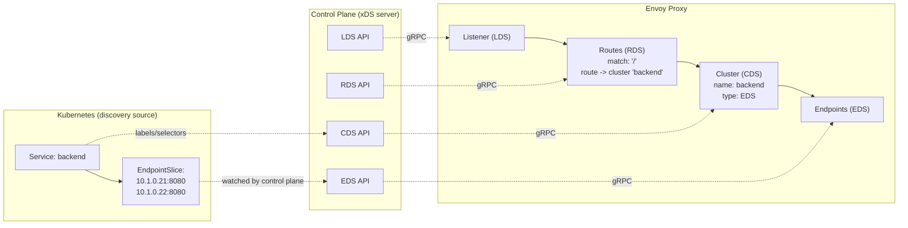

```mermaid
flowchart LR
  subgraph ENVOY["Envoy Proxy"]
    direction TB
    L["Listener (LDS)"]
    R["Routes (RDS)\nmatch: '/'\nroute -> cluster 'backend'"]
    C["Cluster (CDS)\nname: backend\ntype: EDS"]
    E["Endpoints (EDS)"]
    L --> R
    R --> C
    C --> E
  end

  subgraph CONTROL["Control Plane (xDS server)"]
    direction TB
    lds[LDS API]
    rds[RDS API]
    cds[CDS API]
    eds[EDS API]
    lds -.gRPC.-> L
    rds -.gRPC.-> R
    cds -.gRPC.-> C
    eds -.gRPC.-> E
  end

  subgraph K8S["Kubernetes (discovery source)"]
    direction TB
    KS[Service: backend]
    KES[EndpointSlice:\n10.1.0.21:8080\n10.1.0.22:8080]
    KS --> KES
  end

  KES -.watched by control plane.-> eds
  KS -.labels/selectors.-> cds
```
