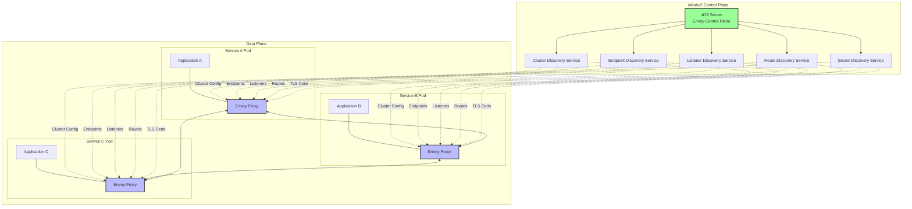

```mermaid 
graph TB
    subgraph "Meshv2 Control Plane"
        XDS[xDS Server<br/>Envoy Control Plane]
        CDS[Cluster Discovery Service]
        EDS[Endpoint Discovery Service]
        LDS[Listener Discovery Service]
        RDS[Route Discovery Service]
        SDS[Secret Discovery Service]
        
        XDS --> CDS
        XDS --> EDS
        XDS --> LDS
        XDS --> RDS
        XDS --> SDS
    end
    
    subgraph "Data Plane"
        subgraph "Service A Pod"
            APP_A[Application A]
            ENVOY_A[Envoy Proxy]
            APP_A --- ENVOY_A
        end
        
        subgraph "Service B Pod"
            APP_B[Application B]
            ENVOY_B[Envoy Proxy]
            APP_B --- ENVOY_B
        end
        
        subgraph "Service C Pod"
            APP_C[Application C]
            ENVOY_C[Envoy Proxy]
            APP_C --- ENVOY_C
        end
    end
    
    CDS -.->|Cluster Config| ENVOY_A
    EDS -.->|Endpoints| ENVOY_A
    LDS -.->|Listeners| ENVOY_A
    RDS -.->|Routes| ENVOY_A
    SDS -.->|TLS Certs| ENVOY_A
    
    CDS -.->|Cluster Config| ENVOY_B
    EDS -.->|Endpoints| ENVOY_B
    LDS -.->|Listeners| ENVOY_B
    RDS -.->|Routes| ENVOY_B
    SDS -.->|TLS Certs| ENVOY_B
    
    CDS -.->|Cluster Config| ENVOY_C
    EDS -.->|Endpoints| ENVOY_C
    LDS -.->|Listeners| ENVOY_C
    RDS -.->|Routes| ENVOY_C
    SDS -.->|TLS Certs| ENVOY_C
    
    ENVOY_A <--> ENVOY_B
    ENVOY_B <--> ENVOY_C
    ENVOY_A <--> ENVOY_C
    
    style XDS fill:#9f9,stroke:#333,stroke-width:2px
    style ENVOY_A fill:#bbf,stroke:#333,stroke-width:2px
    style ENVOY_B fill:#bbf,stroke:#333,stroke-width:2px
    style ENVOY_C fill:#bbf,stroke:#333,stroke-width:2px
```
