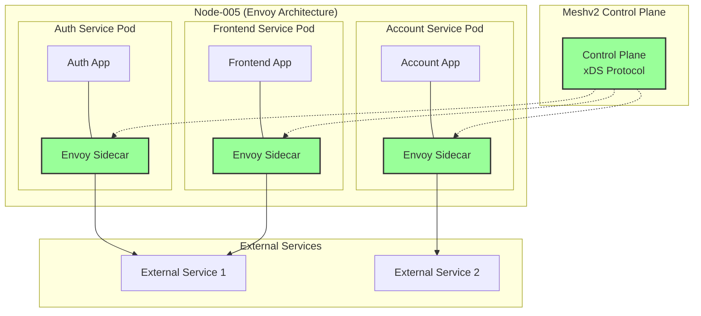

```mermaid
graph TB
    subgraph "Node-005 (Envoy Architecture)"
        subgraph "Auth Service Pod"
            AUTH_APP[Auth App]
            AUTH_ENVOY[Envoy Sidecar]
            AUTH_APP --- AUTH_ENVOY
        end
        
        subgraph "Account Service Pod"
            ACC_APP[Account App]
            ACC_ENVOY[Envoy Sidecar]
            ACC_APP --- ACC_ENVOY
        end
        
        subgraph "Frontend Service Pod"
            FRONT_APP[Frontend App]
            FRONT_ENVOY[Envoy Sidecar]
            FRONT_APP --- FRONT_ENVOY
        end
    end
    
    subgraph "Meshv2 Control Plane"
        CONTROL[Control Plane<br/>xDS Protocol]
    end
    
    subgraph "External Services"
        EXT1[External Service 1]
        EXT2[External Service 2]
    end
    
    AUTH_ENVOY --> EXT1
    ACC_ENVOY --> EXT2
    FRONT_ENVOY --> EXT1
    
    CONTROL -.-> AUTH_ENVOY
    CONTROL -.-> ACC_ENVOY
    CONTROL -.-> FRONT_ENVOY
    
    style AUTH_ENVOY fill:#9f9,stroke:#333,stroke-width:2px
    style ACC_ENVOY fill:#9f9,stroke:#333,stroke-width:2px
    style FRONT_ENVOY fill:#9f9,stroke:#333,stroke-width:2px
    style CONTROL fill:#9f9,stroke:#333,stroke-width:2px
```
