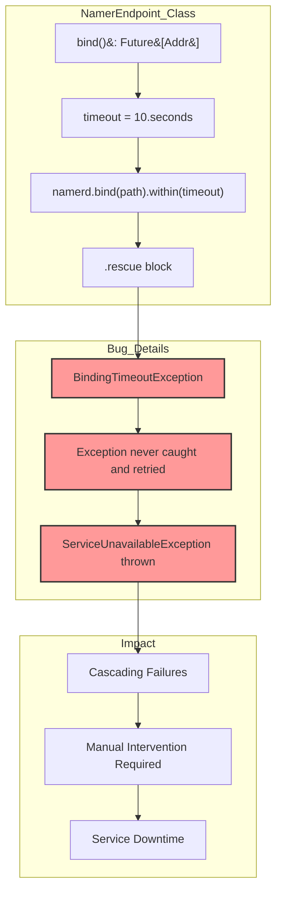

```mermaid
graph TB
    subgraph NamerEndpoint_Class
        BIND["bind()&#58; Future&#91;Addr&#93;"]
        TIMEOUT["timeout = 10.seconds"]
        NAMERD_CALL["namerd.bind(path).within(timeout)"]
        RESCUE[".rescue block"]
    end

    subgraph Bug_Details
        BTE["BindingTimeoutException"]
        NEVER_CAUGHT["Exception never caught and retried"]
        SUE["ServiceUnavailableException thrown"]
    end

    subgraph Impact
        CASCADING["Cascading Failures"]
        MANUAL["Manual Intervention Required"]
        DOWNTIME["Service Downtime"]
    end

    BIND --> TIMEOUT
    TIMEOUT --> NAMERD_CALL
    NAMERD_CALL --> RESCUE
    RESCUE --> BTE
    BTE --> NEVER_CAUGHT
    NEVER_CAUGHT --> SUE

    SUE --> CASCADING
    CASCADING --> MANUAL
    MANUAL --> DOWNTIME

    style BTE fill:#f99,stroke:#333,stroke-width:2px
    style NEVER_CAUGHT fill:#f99,stroke:#333,stroke-width:2px
    style SUE fill:#f99,stroke:#333,stroke-width:2px
```
