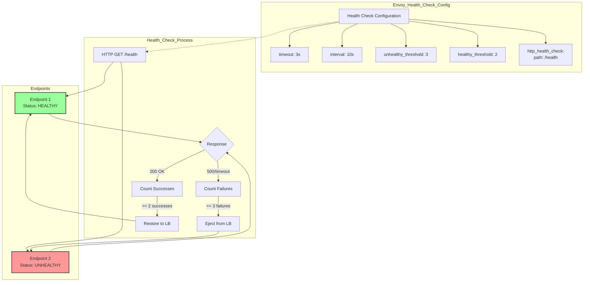

```mermaid
graph TB
    subgraph Envoy_Health_Check_Config
        HC[Health Check Configuration]
        TIMEOUT[timeout: 3s]
        INTERVAL[interval: 10s]
        UNHEALTHY[unhealthy_threshold: 3]
        HEALTHY[healthy_threshold: 2]
        PATH[http_health_check:\npath: /health]

        HC --> TIMEOUT
        HC --> INTERVAL
        HC --> UNHEALTHY
        HC --> HEALTHY
        HC --> PATH
    end

    subgraph Health_Check_Process
        CHECK[HTTP GET /health]
        RESPONSE{Response}
        COUNT_FAIL[Count Failures]
        COUNT_SUCCESS[Count Successes]
        EJECT[Eject from LB]
        RESTORE[Restore to LB]
    end

    subgraph Endpoints
        EP1[Endpoint 1\nStatus: HEALTHY]
        EP2[Endpoint 2\nStatus: UNHEALTHY]
    end

    HC -.-> CHECK
    CHECK --> EP1
    CHECK --> EP2

    EP1 --> RESPONSE
    EP2 --> RESPONSE

    RESPONSE -->|200 OK| COUNT_SUCCESS
    RESPONSE -->|500/timeout| COUNT_FAIL

    COUNT_FAIL -->|>= 3 failures| EJECT
    COUNT_SUCCESS -->|>= 2 successes| RESTORE

    EJECT --> EP2
    RESTORE --> EP1

    style EP1 fill:#9f9,stroke:#333,stroke-width:2px
    style EP2 fill:#f99,stroke:#333,stroke-width:2px
```
