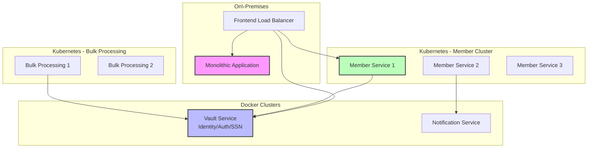

```mermaid
graph TB
    subgraph "On\-Premises"
        MONO[Monolithic Application]
        FLB[Frontend Load Balancer]
    end
    
    subgraph "Docker Clusters"
        VAULT[Vault Service<br/>Identity/Auth/SSN]
        NOTIF[Notification Service]
    end
    
    subgraph "Kubernetes - Member Cluster"
        MEMBER1[Member Service 1]
        MEMBER2[Member Service 2]
        MEMBER3[Member Service 3]
    end
    
    subgraph "Kubernetes - Bulk Processing"
        BULK1[Bulk Processing 1]
        BULK2[Bulk Processing 2]
    end
    
    FLB --> MONO
    FLB --> VAULT
    FLB --> MEMBER1
    MEMBER1 --> VAULT
    MEMBER2 --> NOTIF
    BULK1 --> VAULT
    
    style MONO fill:#f9f,stroke:#333,stroke-width:2px
    style VAULT fill:#bbf,stroke:#333,stroke-width:2px
    style MEMBER1 fill:#bfb,stroke:#333,stroke-width:2px
```
