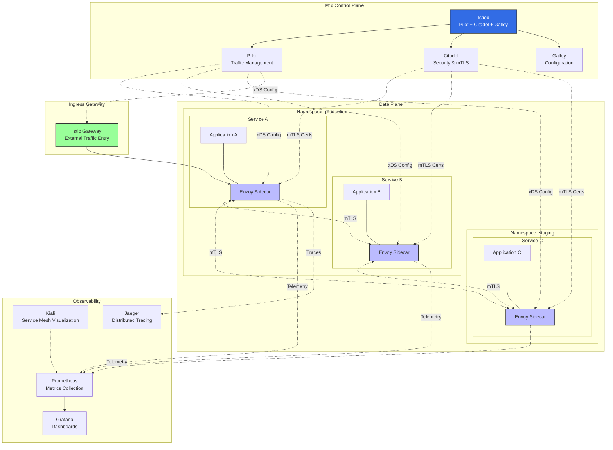

```mermaid
graph TB
    subgraph "Istio Control Plane"
        ISTIOD[Istiod<br/>Pilot + Citadel + Galley]
        PILOT[Pilot<br/>Traffic Management]
        CITADEL[Citadel<br/>Security & mTLS]
        GALLEY[Galley<br/>Configuration]
        
        ISTIOD --> PILOT
        ISTIOD --> CITADEL
        ISTIOD --> GALLEY
    end
    
    subgraph "Data Plane"
        subgraph "Namespace: production"
            subgraph "Service A"
                APP_A[Application A]
                ENVOY_A[Envoy Sidecar]
                APP_A --- ENVOY_A
            end
            
            subgraph "Service B"
                APP_B[Application B]
                ENVOY_B[Envoy Sidecar]
                APP_B --- ENVOY_B
            end
        end
        
        subgraph "Namespace: staging"
            subgraph "Service C"
                APP_C[Application C]
                ENVOY_C[Envoy Sidecar]
                APP_C --- ENVOY_C
            end
        end
    end
    
    subgraph "Ingress Gateway"
        GATEWAY[Istio Gateway<br/>External Traffic Entry]
    end
    
    subgraph "Observability"
        KIALI[Kiali<br/>Service Mesh Visualization]
        JAEGER[Jaeger<br/>Distributed Tracing]
        PROMETHEUS[Prometheus<br/>Metrics Collection]
        GRAFANA[Grafana<br/>Dashboards]
    end
    
    PILOT -.->|xDS Config| ENVOY_A
    PILOT -.->|xDS Config| ENVOY_B
    PILOT -.->|xDS Config| ENVOY_C
    PILOT -.->|xDS Config| GATEWAY
    
    CITADEL -.->|mTLS Certs| ENVOY_A
    CITADEL -.->|mTLS Certs| ENVOY_B
    CITADEL -.->|mTLS Certs| ENVOY_C
    
    ENVOY_A <-.->|mTLS| ENVOY_B
    ENVOY_B <-.->|mTLS| ENVOY_C
    ENVOY_A <-.->|mTLS| ENVOY_C
    
    GATEWAY --> ENVOY_A
    
    ENVOY_A -.->|Telemetry| PROMETHEUS
    ENVOY_B -.->|Telemetry| PROMETHEUS
    ENVOY_C -.->|Telemetry| PROMETHEUS
    
    PROMETHEUS --> GRAFANA
    ENVOY_A -.->|Traces| JAEGER
    KIALI -.-> PROMETHEUS
    
    style ISTIOD fill:#326ce5,color:#fff,stroke:#333,stroke-width:2px
    style GATEWAY fill:#9f9,stroke:#333,stroke-width:2px
    style ENVOY_A fill:#bbf,stroke:#333,stroke-width:2px
    style ENVOY_B fill:#bbf,stroke:#333,stroke-width:2px
    style ENVOY_C fill:#bbf,stroke:#333,stroke-width:2px
```
