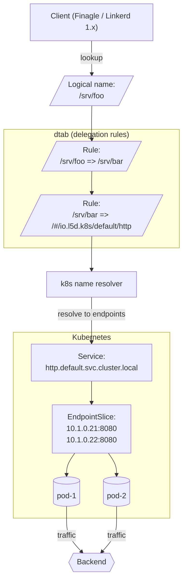

```mermaid
flowchart TB
  A["Client (Finagle / Linkerd 1.x)"]
  A -->|"lookup"| B[/Logical name:\n/srv/foo/]

  subgraph DTAB["dtab (delegation rules)"]
    direction TB
    C[/Rule:\n/srv/foo => /srv/bar/]
    D[/Rule:\n/srv/bar => /#/io.l5d.k8s/default/http/]
  end

  B --> C --> D --> E[k8s name resolver]

  subgraph K8S["Kubernetes"]
    direction TB
    S[Service:\nhttp.default.svc.cluster.local]
    ES[EndpointSlice:\n10.1.0.21:8080\n10.1.0.22:8080]
    P1[(pod-1)]
    P2[(pod-2)]
    S --> ES
    ES --> P1
    ES --> P2
  end

  E -->|"resolve to endpoints"| S
  P1 & P2 -->|"traffic"| Z{{Backend}}
```
