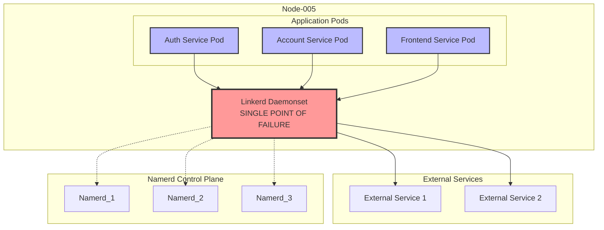

```mermaid
graph TB
    subgraph "Node-005"
        subgraph "Application Pods"
            AUTH[Auth Service Pod]
            ACCOUNT[Account Service Pod]
            FRONTEND[Frontend Service Pod]
        end
        
        LINKERD[Linkerd Daemonset<br/>SINGLE POINT OF FAILURE]
        
        AUTH --> LINKERD
        ACCOUNT --> LINKERD
        FRONTEND --> LINKERD
    end
    
    subgraph "External Services"
        EXT1[External Service 1]
        EXT2[External Service 2]
    end
    
    subgraph "Namerd Control Plane"
        NAMERD1[Namerd_1]
        NAMERD2[Namerd_2]
        NAMERD3[Namerd_3]
    end
    
    LINKERD --> EXT1
    LINKERD --> EXT2
    LINKERD -.-> NAMERD1
    LINKERD -.-> NAMERD2
    LINKERD -.-> NAMERD3
    
    style LINKERD fill:#f99,stroke:#333,stroke-width:3px
    style AUTH fill:#bbf,stroke:#333,stroke-width:2px
    style ACCOUNT fill:#bbf,stroke:#333,stroke-width:2px
    style FRONTEND fill:#bbf,stroke:#333,stroke-width:2px
```
