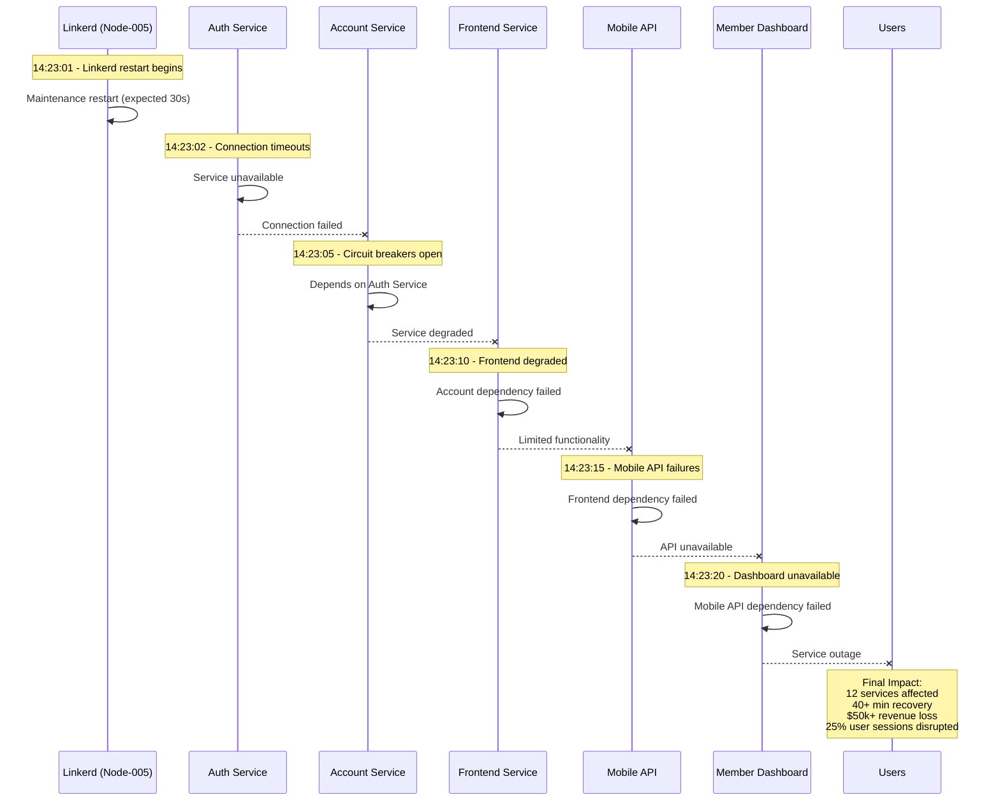

```mermaid
sequenceDiagram
    participant L as Linkerd (Node-005)
    participant A as Auth Service
    participant ACC as Account Service  
    participant F as Frontend Service
    participant M as Mobile API
    participant D as Member Dashboard
    participant U as Users
    
    Note over L: 14:23:01 - Linkerd restart begins
    L->>L: Maintenance restart (expected 30s)
    
    Note over A: 14:23:02 - Connection timeouts
    A->>A: Service unavailable
    A--xACC: Connection failed
    
    Note over ACC: 14:23:05 - Circuit breakers open
    ACC->>ACC: Depends on Auth Service
    ACC--xF: Service degraded
    
    Note over F: 14:23:10 - Frontend degraded
    F->>F: Account dependency failed
    F--xM: Limited functionality
    
    Note over M: 14:23:15 - Mobile API failures
    M->>M: Frontend dependency failed
    M--xD: API unavailable
    
    Note over D: 14:23:20 - Dashboard unavailable
    D->>D: Mobile API dependency failed
    D--xU: Service outage
    
    Note over U: Final Impact:<br/>12 services affected<br/>40+ min recovery<br/>$50k+ revenue loss<br/>25% user sessions disrupted
```
