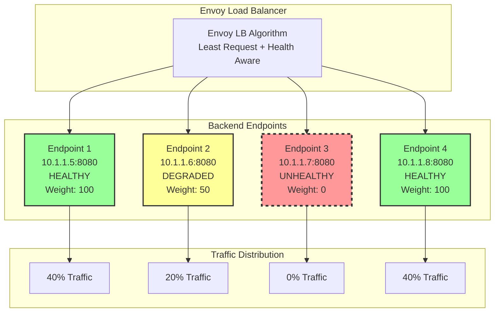

```mermaid
graph TB
    subgraph "Envoy Load Balancer"
        LB[Envoy LB Algorithm<br/>Least Request + Health Aware]
    end
    
    subgraph "Backend Endpoints"
        EP1[Endpoint 1<br/>10.1.1.5:8080<br/>HEALTHY<br/>Weight: 100]
        EP2[Endpoint 2<br/>10.1.1.6:8080<br/>DEGRADED<br/>Weight: 50]
        EP3[Endpoint 3<br/>10.1.1.7:8080<br/>UNHEALTHY<br/>Weight: 0]
        EP4[Endpoint 4<br/>10.1.1.8:8080<br/>HEALTHY<br/>Weight: 100]
    end
    
    subgraph "Traffic Distribution"
        T1[40% Traffic]
        T2[20% Traffic]
        T3[0% Traffic]
        T4[40% Traffic]
    end
    
    LB --> EP1
    LB --> EP2
    LB --> EP3
    LB --> EP4
    
    EP1 --> T1
    EP2 --> T2
    EP3 --> T3
    EP4 --> T4
    
    style EP1 fill:#9f9,stroke:#333,stroke-width:2px
    style EP2 fill:#ff9,stroke:#333,stroke-width:2px
    style EP3 fill:#f99,stroke:#333,stroke-width:3px,stroke-dasharray: 5 5
    style EP4 fill:#9f9,stroke:#333,stroke-width:2px
```
