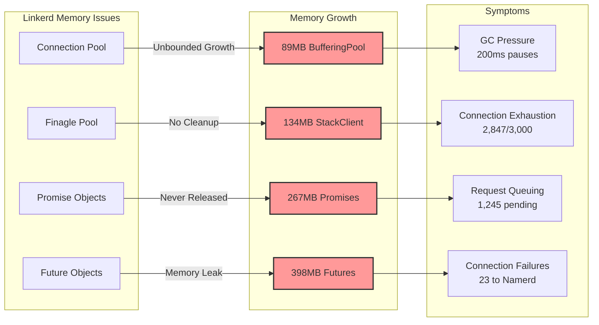

```mermaid
graph LR
    subgraph "Linkerd Memory Issues"
        CP[Connection Pool]
        FP[Finagle Pool]
        PROM[Promise Objects]
        FUT[Future Objects]
    end
    
    subgraph "Memory Growth"
        CP --> |"Unbounded Growth"| LEAK1[89MB BufferingPool]
        FP --> |"No Cleanup"| LEAK2[134MB StackClient]
        PROM --> |"Never Released"| LEAK3[267MB Promises]
        FUT --> |"Memory Leak"| LEAK4[398MB Futures]
    end
    
    subgraph "Symptoms"
        LEAK1 --> GC[GC Pressure<br/>200ms pauses]
        LEAK2 --> CONN[Connection Exhaustion<br/>2,847/3,000]
        LEAK3 --> QUEUE[Request Queuing<br/>1,245 pending]
        LEAK4 --> FAIL[Connection Failures<br/>23 to Namerd]
    end
    
    style LEAK1 fill:#f99,stroke:#333,stroke-width:2px
    style LEAK2 fill:#f99,stroke:#333,stroke-width:2px
    style LEAK3 fill:#f99,stroke:#333,stroke-width:2px
    style LEAK4 fill:#f99,stroke:#333,stroke-width:2px
```
