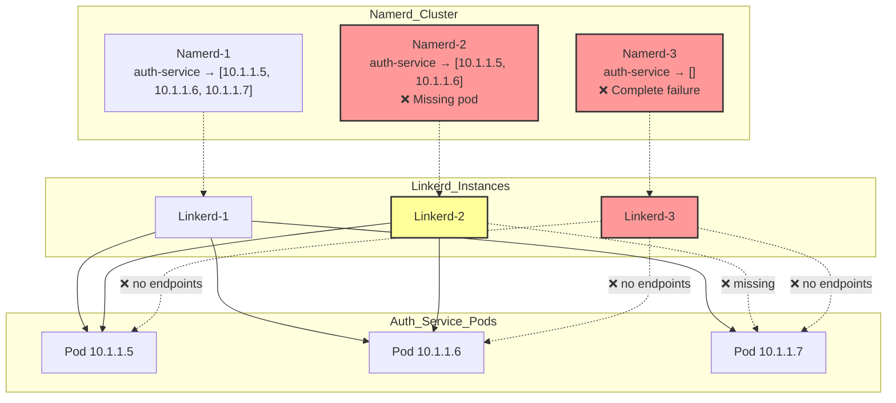

```mermaid
graph TB
    %% --- Namerd cluster state
    subgraph Namerd_Cluster
        N1["Namerd-1\nauth-service → [10.1.1.5, 10.1.1.6, 10.1.1.7]"]
        N2["Namerd-2\nauth-service → [10.1.1.5, 10.1.1.6]\n❌ Missing pod"]
        N3["Namerd-3\nauth-service → []\n❌ Complete failure"]
    end

    %% --- Linkerd instances
    subgraph Linkerd_Instances
        L1[Linkerd-1]
        L2[Linkerd-2]
        L3[Linkerd-3]
    end

    %% --- Auth service pods
    subgraph Auth_Service_Pods
        P1[Pod 10.1.1.5]
        P2[Pod 10.1.1.6]
        P3[Pod 10.1.1.7]
    end

    %% Control-plane updates (dotted)
    N1 -.-> L1
    N2 -.-> L2
    N3 -.-> L3

    %% Healthy data-plane paths (solid)
    L1 --> P1
    L1 --> P2
    L1 --> P3

    L2 --> P1
    L2 --> P2

    %% Failing/absent paths (dotted with labels; avoids linkStyle index issues)
    L2 -. "❌ missing" .-> P3
    L3 -. "❌ no endpoints" .-> P1
    L3 -. "❌ no endpoints" .-> P2
    L3 -. "❌ no endpoints" .-> P3

    %% Node styles (works across Mermaid versions)
    style N2 fill:#f99,stroke:#333,stroke-width:2px
    style N3 fill:#f99,stroke:#333,stroke-width:2px
    style L2 fill:#ff9,stroke:#333,stroke-width:2px
    style L3 fill:#f99,stroke:#333,stroke-width:2px
```
