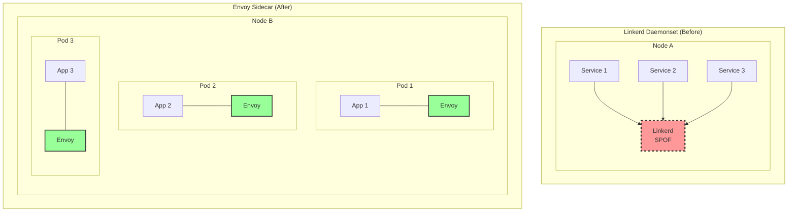

```mermaid
graph TB
    subgraph "Linkerd Daemonset (Before)"
        subgraph "Node A"
            LA_SVC1[Service 1]
            LA_SVC2[Service 2]
            LA_SVC3[Service 3]
            LA_LINKERD[Linkerd<br/>SPOF]
            
            LA_SVC1 --> LA_LINKERD
            LA_SVC2 --> LA_LINKERD
            LA_SVC3 --> LA_LINKERD
        end
    end
    
    subgraph "Envoy Sidecar (After)"
        subgraph "Node B"
            subgraph "Pod 1"
                EA_APP1[App 1]
                EA_ENVOY1[Envoy]
                EA_APP1 --- EA_ENVOY1
            end
            subgraph "Pod 2"
                EA_APP2[App 2]
                EA_ENVOY2[Envoy]
                EA_APP2 --- EA_ENVOY2
            end
            subgraph "Pod 3"
                EA_APP3[App 3]
                EA_ENVOY3[Envoy]
                EA_APP3 --- EA_ENVOY3
            end
        end
    end
    
    style LA_LINKERD fill:#f99,stroke:#333,stroke-width:3px,stroke-dasharray: 5 5
    style EA_ENVOY1 fill:#9f9,stroke:#333,stroke-width:2px
    style EA_ENVOY2 fill:#9f9,stroke:#333,stroke-width:2px
    style EA_ENVOY3 fill:#9f9,stroke:#333,stroke-width:2px
```
