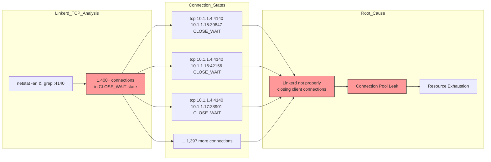

```mermaid
graph LR
    subgraph Linkerd_TCP_Analysis
        NETSTAT[netstat -an &#124; grep :4140]
        RESULTS[1,400+ connections\nin CLOSE_WAIT state]
    end

    subgraph Connection_States
        CW1[tcp 10.1.1.4:4140 10.1.1.15:39847 CLOSE_WAIT]
        CW2[tcp 10.1.1.4:4140 10.1.1.16:42156 CLOSE_WAIT]
        CW3[tcp 10.1.1.4:4140 10.1.1.17:38901 CLOSE_WAIT]
        MORE[... 1,397 more connections]
    end

    subgraph Root_Cause
        ISSUE[Linkerd not properly\nclosing client connections]
        LEAK[Connection Pool Leak]
        EXHAUST[Resource Exhaustion]
    end

    NETSTAT --> RESULTS
    RESULTS --> CW1
    RESULTS --> CW2
    RESULTS --> CW3
    RESULTS --> MORE

    CW1 --> ISSUE
    CW2 --> ISSUE
    CW3 --> ISSUE
    MORE --> ISSUE

    ISSUE --> LEAK
    LEAK --> EXHAUST

    style RESULTS fill:#f99,stroke:#333,stroke-width:2px
    style ISSUE fill:#f99,stroke:#333,stroke-width:2px
    style LEAK fill:#f99,stroke:#333,stroke-width:2px
```
