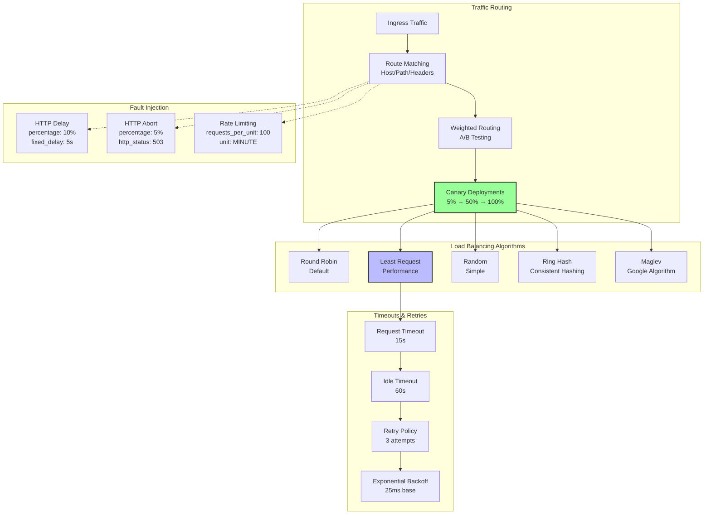

```mermaid
flowchart TB
    subgraph "Traffic Routing"
        INGRESS[Ingress Traffic]
        ROUTE_MATCH[Route Matching<br/>Host/Path/Headers]
        WEIGHTED[Weighted Routing<br/>A/B Testing]
        CANARY[Canary Deployments<br/>5% → 50% → 100%]
    end
    
    subgraph "Fault Injection"
        DELAY[HTTP Delay<br/>percentage: 10%<br/>fixed_delay: 5s]
        ABORT[HTTP Abort<br/>percentage: 5%<br/>http_status: 503]
        RATE_LIMIT[Rate Limiting<br/>requests_per_unit: 100<br/>unit: MINUTE]
    end
    
    subgraph "Load Balancing Algorithms"
        ROUND_ROBIN[Round Robin<br/>Default]
        LEAST_REQUEST[Least Request<br/>Performance]
        RANDOM[Random<br/>Simple]
        RING_HASH[Ring Hash<br/>Consistent Hashing]
        MAGLEV[Maglev<br/>Google Algorithm]
    end
    
    subgraph "Timeouts & Retries"
        REQ_TIMEOUT[Request Timeout<br/>15s]
        IDLE_TIMEOUT[Idle Timeout<br/>60s]
        RETRY_POLICY[Retry Policy<br/>3 attempts]
        BACKOFF[Exponential Backoff<br/>25ms base]
    end
    
    INGRESS --> ROUTE_MATCH
    ROUTE_MATCH --> WEIGHTED
    WEIGHTED --> CANARY
    
    ROUTE_MATCH -.-> DELAY
    ROUTE_MATCH -.-> ABORT
    ROUTE_MATCH -.-> RATE_LIMIT
    
    CANARY --> ROUND_ROBIN
    CANARY --> LEAST_REQUEST
    CANARY --> RANDOM
    CANARY --> RING_HASH
    CANARY --> MAGLEV
    
    LEAST_REQUEST --> REQ_TIMEOUT
    REQ_TIMEOUT --> IDLE_TIMEOUT
    IDLE_TIMEOUT --> RETRY_POLICY
    RETRY_POLICY --> BACKOFF
    
    style CANARY fill:#9f9,stroke:#333,stroke-width:2px
    style LEAST_REQUEST fill:#bbf,stroke:#333,stroke-width:2px
```
