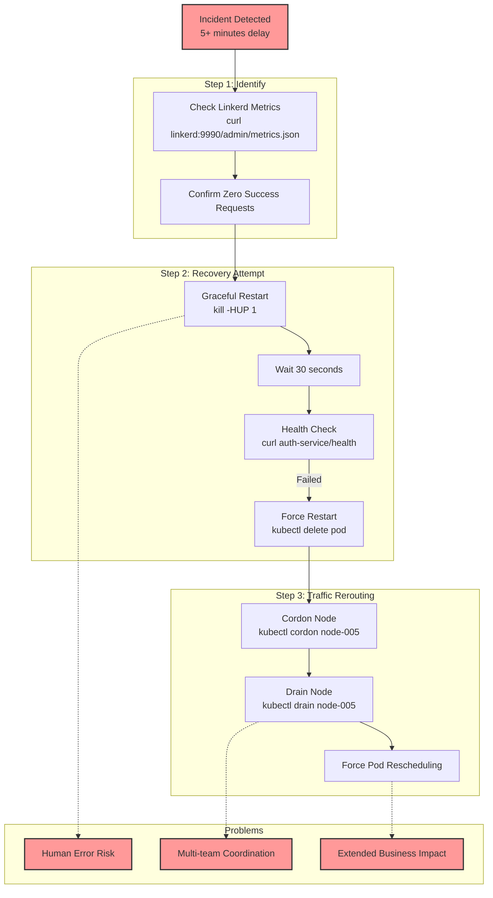

```mermaid
flowchart TD
    DETECT[Incident Detected<br/>5+ minutes delay]
    
    subgraph "Step 1: Identify"
        METRICS[Check Linkerd Metrics<br/>curl linkerd:9990/admin/metrics.json]
        CONFIRM[Confirm Zero Success Requests]
    end
    
    subgraph "Step 2: Recovery Attempt"
        GRACEFUL[Graceful Restart<br/>kill -HUP 1]
        WAIT[Wait 30 seconds]
        CHECK[Health Check<br/>curl auth-service/health]
        FORCE[Force Restart<br/>kubectl delete pod]
    end
    
    subgraph "Step 3: Traffic Rerouting"
        CORDON[Cordon Node<br/>kubectl cordon node-005]
        DRAIN[Drain Node<br/>kubectl drain node-005]
        RESCHEDULE[Force Pod Rescheduling]
    end
    
    subgraph "Problems"
        HUMAN[Human Error Risk]
        COORD[Multi-team Coordination]
        DOWNTIME[Extended Business Impact]
    end
    
    DETECT --> METRICS
    METRICS --> CONFIRM
    CONFIRM --> GRACEFUL
    GRACEFUL --> WAIT
    WAIT --> CHECK
    CHECK -->|Failed| FORCE
    FORCE --> CORDON
    CORDON --> DRAIN
    DRAIN --> RESCHEDULE
    
    GRACEFUL -.-> HUMAN
    DRAIN -.-> COORD
    RESCHEDULE -.-> DOWNTIME
    
    style DETECT fill:#f99,stroke:#333,stroke-width:2px
    style HUMAN fill:#f99,stroke:#333,stroke-width:2px
    style COORD fill:#f99,stroke:#333,stroke-width:2px
    style DOWNTIME fill:#f99,stroke:#333,stroke-width:2px
```
